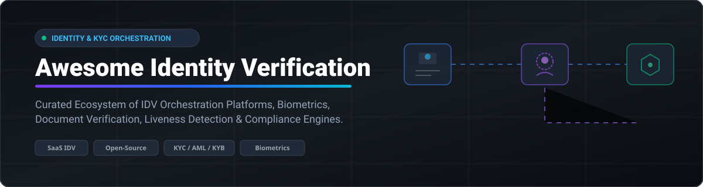

# Awesome Identity Verification Orchestration 🛡️

  
  
  
  
  

## 🚀 Overview & Market Intelligence

A curated list of **Identity Verification (IDV) Orchestration Platforms**, **Biometric APIs**, **Document OCR Engines**, **Liveness Detection Libraries**, and **KYC/AML Compliance Frameworks**.

> 📊 **Market Insights (2026):**
> The global **Identity Verification (IDV)** market size is estimated at **$15.8 Billion in 2026** and is projected to reach **$32.5 Billion by 2031**, growing at a CAGR of 15.5%. 
> 
> **Market Concentration:** The market is **moderately fragmented**. While legacy giants (Jumio, Entrust/Onfido) and hyper-growth unicorns (Persona, Incode, Sumsub, Veriff, Trulioo) capture significant enterprise share, specialized region-specific platforms (Signicat in Europe) and emerging open-source biometric primitives prevent a single "winner-take-all" dynamic.

---

## 📑 Table of Contents

- [☁️ SaaS / Hosted Identity Verification Platforms](#️-saas--hosted-identity-verification-platforms)
- [💻 Open-Source GitHub Projects](#-open-source-github-projects)
- [🛠️ How to Contribute](#️-how-to-contribute)
- [☕ Support & Community](#-support--community)
- [⚠️ Disclaimer](#️-disclaimer)
- [📈 Star History](#-star-history)

---

## ☁️ SaaS / Hosted Identity Verification Platforms

Below is a comparison of top commercial IDV orchestration providers, sorted by company size (valuation / revenue):

| Vendor 🏢 | Scale & Size 💰 | Pricing Model 💳 | Free Tier / Trial Limit 🎁 | Description & Core Capabilities 🔍 |
| :--- | :--- | :--- | :--- | :--- |
| **[Incode](https://incode.com/)** | **$3.0B** Valuation / ~$170M ARR | Enterprise platform licensing + volume-based checks | Sandbox Access (100 free test verifications / 14-day trial) | AI-first identity verification platform focused on biometrics, document authentication, and omnichannel UX. |
| **[Persona](https://withpersona.com/)** | **$2.0B** Valuation / ~$125M ARR | Custom Growth/Enterprise tiers + per-check overage | **Starter Tier (Free):** 500 free ID verifications / month | Flexible identity verification & orchestration platform with composable modules and no-code workflow builders. |
| **[Trulioo](https://www.trulioo.com/)** | **$1.8B** Valuation / ~$150M ARR | Enterprise usage-based tiers (starts ~$99/mo base) | Sandbox API Demo License (no production free tier) | Global identity platform specializing in electronic identity verification (eIDV), business verification (KYB), & watchlist screening. |
| **[Veriff](https://www.veriff.com/)** | **$1.5B** Valuation / ~$110M ARR | Starts at **$0.80/check** ($49/mo commitment) | **15-Day Free Trial:** Includes up to 50 live verification sessions | High-automation IDV known for broad document coverage, fast decisions, and AI deepfake defense. |
| **[Sumsub](https://sumsub.com/)** | **$1.1B** Valuation / ~$100M ARR | Starts at **$1.35/check** ($149/mo commitment) | **14-Day Free Trial:** Includes 50 free verification checks | Full-stack verification suite covering KYC, KYB, AML screening, transaction monitoring, & orchestration. |
| **[Onfido / Entrust IDV](https://www.entrust.com/)** | **$650M** Acquired / ~$140M ARR | Pay-per-verification enterprise contracts | Developer Sandbox Access (upon sales consultation demo) | Enterprise identity suite combining document & biometric checks with fraud detection orchestration. |
| **[AU10TIX](https://www.au10tix.com/)** | **$260M** Valuation / ~$50M ARR | Tiered enterprise plans (starts ~$500/mo minimum) | Product Demo Access (no standalone free trial) | Automation-driven document intelligence, biometric verification, and dynamic identity decisioning. |
| **[Signicat](https://www.signicat.com/)** | Private (~€140M / $150M ARR) | Volume-based per-transaction pricing | **Free Developer Sandbox Account** via Signicat Dashboard | European digital identity provider integrating eID schemes, electronic signatures, and compliant onboarding. |
| **[Jumio](https://www.jumio.com/)** | Private (~$200M+ Annual Bookings) | Enterprise custom volume contracts | Proof-of-Concept / Demo Access upon request | Enterprise identity verification, document validation, AML watchlist screening, and biometric authentication. |
| **[ID-Pal](https://www.id-pal.com/)** | Private (~$10M+ Raised) | Usage-based SaaS subscription tiers | Request-based Free Demo (no instant self-serve trial) | Turnkey identity verification and KYC/AML compliance platform tailored for SMEs and quick integrations. |

---

## 💻 Open-Source GitHub Projects

Curated open-source repositories for biometric face matching, document scanning, liveness detection, and KYC compliance. Sorted by **GitHub Star Count** (descending):

| Repository 📦 | GitHub Stars ⭐ | Description & Focus Area 🎯 |
| :--- | :--- | :--- |
| **[kby-ai/FaceRecognition-Android](https://github.com/kby-ai/FaceRecognition-Android)** |  | Native Android SDK providing offline face recognition, liveness detection, and biometric ID matching. |
| **[moov-io/watchman](https://github.com/moov-io/watchman)** |  | Open-source Go engine for AML, OFAC, PEP, and sanction list screening in KYC workflows. |
| **[microblink/blinkid-android](https://github.com/microblink/blinkid-android)** |  | AI-driven mobile SDK for scanning and OCR data extraction from passports, IDs, and driver's licenses. |
| **[FaceOnLive/ID-Verification-OpenKYC](https://github.com/FaceOnLive/ID-Verification-OpenKYC)** |  | Community-driven OpenKYC components for face liveness anti-spoofing and document recognition pipelines. |
| **[microblink/blinkid-ios](https://github.com/microblink/blinkid-ios)** |  | iOS SDK for identity document OCR scanning and identity verification data extraction. |
| **[recognito-vision/Linux-FaceRecognition-FaceLivenessDetection](https://github.com/recognito-vision/Linux-FaceRecognition-FaceLivenessDetection)** |  | Linux server SDK for high-performance facial matching, passive liveness checks, and eKYC pipelines. |
| **[OpenBiometrics](https://openbiometrics.dev/)** |  | Self-hostable biometric engine (MIT) offering face matching, passive liveness, MRZ parsing, and REST APIs. |
| **[bp-ventures/kyc-beacon](https://github.com/bp-ventures/kyc-beacon)** |  | Self-hosted open-source KYC scaffold combining document OCR, selfie liveness, and review dashboards. |

---

### 💡 Building Custom Identity Verification Workflows

When orchestrating identity verification with open-source tools:
1. **Document Capture & Extraction:** Use libraries like `microblink/blinkid-android` or Tesseract/EasyOCR for MRZ and barcode parsing.
2. **Biometric Face Verification:** Apply `kby-ai/FaceRecognition-Android` or `recognito-vision` for 1:1 face embedding match between ID photo and selfie.
3. **Liveness & Anti-Spoofing:** Deploy `FaceOnLive/ID-Verification-OpenKYC` to detect screen replay, print photos, or 3D mask attacks.
4. **Sanctions & Compliance Screening:** Integrate `moov-io/watchman` to auto-check user names against global OFAC, EU, and UN sanction lists.

> 🔒 **Enterprise Note:** For regulated financial institutions (FinTech, Crypto, Banking), full compliance typically requires commercial IDV orchestrators (Persona, Veriff, Sumsub) due to certified deepfake defenses, global document coverage, and legal audit trails.

---

## 🛠️ How to Contribute

Contributions are highly appreciated! To submit a new tool or update an existing entry:

1. Fork this repository. 🍴
2. Modify `README.md` with factual descriptions and links. 📝
3. Ensure open-source projects include star count badges linked to stargazers. 🌟
4. Open a Pull Request with a clear summary of changes. 🚀

---

## 💖 Support & Community

If you found this resource helpful, please consider supporting the project:

- 🌟 **Star this repository** to help others discover it.
- 🔀 **Fork it** to customize your own identity verification workflows.
- 📢 **Share it** with fellow identity, compliance, and fraud engineers!
- ☕ **Buy Me a Coffee:** Support ongoing maintenance via the [GitHub Sponsor Dashboard](https://github.com/sponsors/ishandutta2007).

---

## ⚠️ Disclaimer

- This repository is a **community-curated list** for informational and educational purposes only.
- Identity verification involves processing sensitive PII data subject to GDPR, CCPA, and global KYC/AML mandates. Ensure proper security, encryption, and legal compliance before deploying any self-hosted or open-source solutions.

---

## 📈 Star History

